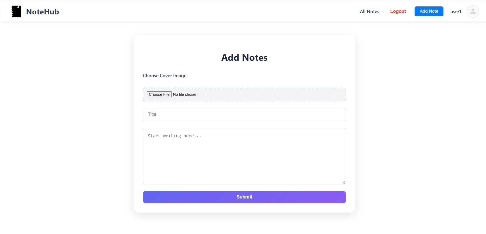

# 📝 NoteHub – MERN Stack Note-Taking App

NoteHub is a full-stack note management system built using the MERN stack (MongoDB, Express.js, React, Node.js). It enables users to register, login, create personal notes with images, and manage them through an intuitive dashboard.

---

## 🚀 Features

- 🔐 **Authentication**: Secure JWT-based login & signup
- 🗂️ **Notes CRUD**: Create, Read, Update, Delete personal notes
- 🖼️ **Image Upload**: Upload and preview images with your notes
- 📱 **Responsive UI**: Styled with SCSS, optimized for mobile and desktop
- 📄 **Card Grid**: Clean 3-column layout for note cards
- 📸 **Dynamic Media**: Notes can include visual content for better recall

---

## 🛠️ Tech Stack

- **Frontend**: React, React Router, SCSS
- **Backend**: Node.js, Express.js
- **Database**: MongoDB
- **Auth**: JWT (JSON Web Token)
- **State Management**: React Hooks (optional: React Query)
- **File Upload**: Multer (backend), Static file serving

---

## 📦 Project Structure

NoteHub/
├── Backend/
│ ├── controllers/
│ ├── models/
│ ├── routes/
│ ├── uploads/
│ └── server.js
├── Frontend/
│ ├── src/
│ │ ├── components/
│ │ ├── pages/
│ │ ├── utils/
│ │ └── App.jsx


---

## 💻 Setup Instructions

### Prerequisites

- Node.js & npm
- MongoDB (Local or Atlas)

### Clone Repository

```bash
git clone https://github.com/your-username/notehub.git
cd notehub

Backend Setup
bash
cd Backend
npm install
npm run dev
Create a .env file:


PORT=8080
MONGO_URI=your_mongodb_uri
JWT_SECRET=your_secret_key

Frontend Setup
cd Frontend
npm install
npm start
🌐 Environment Variables
Variable	Description
MONGO_URI	MongoDB connection string
JWT_SECRET	Secret for JWT auth
PORT	Backend port (default 8080)

##📸 Screenshots

### 🔐 Dashboard Page  

### 🔐 Login Page 

### 🔐 Register Page 

### 🔐 Note 

### 🔐 Edit 

### 🔐 Add Page 


🙋‍♂️ Author
Sarthak Singh

